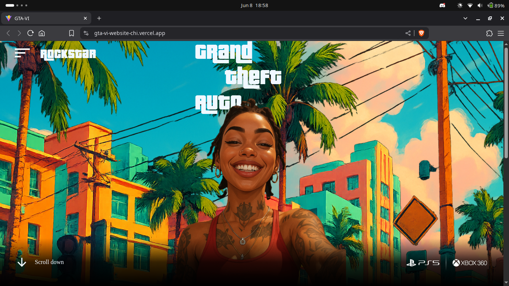

# GTA VI Website

A simple React-based website showcasing Grand Theft Auto VI (GTA VI) with a clean UI.



## Features

- Responsive design
- Modern UI with animations
- Information sections about GTA VI
- Countdown timer (example)

## Technologies Used

- React.js
- CSS3
- Vercel (for deployment)

## Live Demo

👉 [View on Vercel](https://gta-vi-website-chi.vercel.app/)

## Installation

1. Clone the repository:
   ```bash
   git clone https://github.com/piyushh7274/GTA-VI-Website.git
2. Install dependencies:
   npm install
3.Run the development server:
   npm run dev
